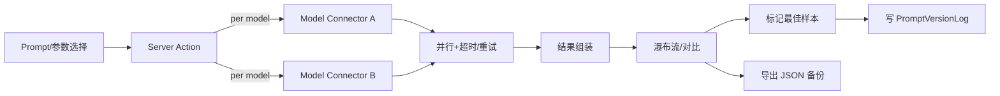

# AI Image Platform 设计摘要

## 平台定位与 MVP 范围

- 定位：个人优先的多模型生图工作台，统一 Prompt 管理，快速对比 Google nano banana、Dreamseed4.0、Qwen-image-edit 等模型输出，可沉淀最佳样本。
- MVP 核心：Prompt 库（标签/变量/版本日志）、模型配置（多厂商 API Key + 默认参数模板）、单次多模型对比生成、瀑布流/并排查看、最佳样本标记回写 PromptVersionLog、生成历史（可导出）。
- 非目标（延后到 V2+）：自动评分/统计、批量参数扫描、二次编辑（裁切/放大/inpainting）、协作/角色、多租户计费。

## 技术架构与存储策略

- 栈：Next.js 16（App Router + Server Actions 默认），Prisma ORM（当前锁定 5.19，SQLite）。
- 开发/本地：SQLite 文件 `prisma/dev.db`（Prisma `provider = "sqlite"`，JSON/枚举用字符串存储，业务侧自行 JSON.parse）。
- 生产建议：改用托管 SQLite 兼容（libsql/Turso）或 Vercel Postgres/KV，更新 `DATABASE_URL` 即可迁移；Vercel 无持久盘，不要依赖本地 SQLite。
- 数据保留：在无远端库时，可提供 JSON 导出/导入作为备份；有远端库则以数据库为准。
- 模型接入：按提供商封装 Model Connector（参数映射/校验/错误隔离/超时）。

## 数据模型（Prisma 视角）

- `Prompt`: id, title, body, tags[], variables[], version, createdAt, updatedAt
- `PromptVersionLog`: id, promptId, modelId, modelParams(json), sampleUrl, note, createdAt
- `ModelConfig`: id, provider, modelName, apiKeyRef, defaults(json)
- `GenerationRequest`: id, promptId, models[], paramsOverride(json), createdAt
- `GenerationResult`: id, requestId, modelId, status, imageUrl, paramsUsed(json), elapsedMs, error?

## 关键流程（单次多模型生成）

## 业务规则与约束

- 参数校验：分辨率/步数/CFG 按各模型允许范围映射，否则拒绝/提示。
- 并发/超时：多模型并行但需最大并发与超时，失败不影响其他模型；重试次数受限。
- 最佳样本：标记后记录模型、参数、时间、样本 URL 到 PromptVersionLog。
- 历史与导出：生成历史按实验/模型分组，支持 JSON 导出备份。

## 资产与引用

- Prompt/角色文件：`agents/`（产品基准）与 `my- agents/`（提示词/助手角色集合，如 ai-image-prompt-optimizer, qwen-image-edit-assistant, seedream4-image-assistant 等）。
- 设计讨论基线：产品愿景 `agents/product.md`；实现规范 `docs/design.md`（本文）。
- 提示词导入：社区收藏 `banana-prompt-quicker` 已下载至 `data/prompts/banana-prompts.json`，可用 `npm run db:import:banana` 导入 SQLite（会自动跳过已存在 title）。基础种子脚本：`npm run db:seed`。
